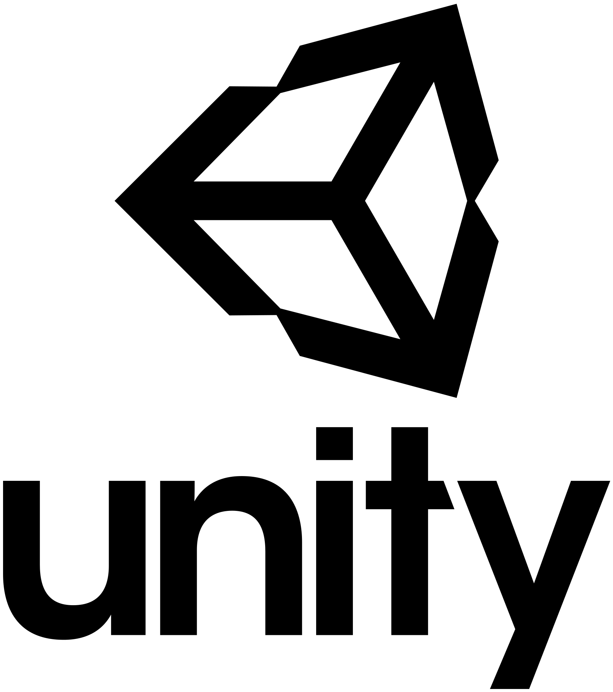

<h1 align="center">Hi 👋, I'm Salman Jan</h1>
<h3 align="center">I'm a Computer Science graduate passionate about Game Development and Software Engineering.</h3>

- 🌱 I’m currently learning **Netcode for multiplayer games in Unity**

<h3 align="left">Languages and Tools:</h3>

                      

## 🚀 Projects

### 🎮 Game Development

### 🔹 [V-Escape – Procedural Horror Escape Game](https://github.com/salmanjann/V-Escape)
*C#, Unity*  
- Procedurally generates a Haunted house, Labyrinth and Forest layouts on each playthrough. [Proc Gen room demo](https://drive.google.com/file/d/1_zjdH2yIWtO6s5WwdlcfSsY2K27CZ-at/view?usp=sharing)
- Single-pass algorithm for optimized object placement.  
- My Final Year Project (FYP), focusing on modular design and performance.

#### 🔹 [Crypt Raider – 3D Dungeon Escape](https://drive.google.com/file/d/1e84KX9LT2AeHqTASFKcZHsl4cn81OD1N/view?usp=sharing)
*C++, Unreal Engine*  
- Modular level design, immersive horror environment.  
- Used raycasting, player mechanics, and dynamic lighting with Blueprints & C++.

#### 🔹 [Snake 2D – Color-Split Gameplay](https://drive.google.com/file/d/1S58T7joHbvtXtawjJVyknmXOcvxMiVKx/view?usp=sharing)
*C#, Unity*  [Repository](https://github.com/salmanjann/Snake)
- Half black, half white game field with dynamic color inversion.  
- Polished transitions, food, portals, and UI synced with snake position.

#### 🔹 [Pong Game Clone](https://play.unity.com/mg/other/pong-game-salmanii)
*C#, Unity*  
- Neon-style visuals, AI opponent, local multiplayer, difficulty levels.

#### 🔹 [Fragments of Fate – 2D Platformer](https://drive.google.com/file/d/1v9DhyGa2YleNMLmN6axdNwj7lkx7uJAi/view?usp=sharing)
*C#, Unity*  [Repository](https://github.com/salmanjann/Fragments-of-Fate)
- Player movement, enemy AI, tilemaps, collectibles, and custom animations.

---
### 🧠 Academic Projects

#### 🔹 [Subway Surfers Redesign with Multiplayer Concept](https://www.figma.com/proto/RcTBPI26tdLVhhSdsLA3em/Cyber-Surfers?node-id=0-1&t=KYwxuolDndCYWX0S-1)
*Figma*  
- Modernized the game's interface using Figma for a cleaner, more intuitive experience.  
- Introduced a multiplayer feature concept to enhance competitive gameplay.

#### 🔹 [Computer Vision Assignments – Geospatial + Deep Learning](https://github.com/salmanjann/Computer-Vision)
*Python, PyTorch, OpenCV, GDAL*  
- SIFT-based image stitching and geolocation with GDAL.  
- BoVW and CNN for image classification.

#### 🔹 [Automated Timetable Scheduler](https://github.com/salmanjann/Time-Table-Scheduler)
*Python*  
- Genetic algorithm for optimizing schedules of 46+ course sections.  
- Constraint satisfaction with Excel export support.

#### 🔹 [Delivery Robot Path Finder](https://github.com/salmanjann/Delivery-Robot-Path-Finder)
*C++*  
- Finds a Hamiltonian circuit within time limits (travel + delivery).

#### 🔹 [MLOps-Based Environmental Monitoring System](https://github.com/salmanjann/Environmental-Monitoring-System)
*Python, Mlflow, DVC*  
- Automates data collection and versioning using DVC with live weather and air quality APIs.
- Deploys time-series ML models with MLflow and monitors predictions via Grafana dashboards.

#### 🔹 [Multi-threaded Neural Network Training](https://github.com/salmanjann/Multi-threaded-NN-C-)
*C++ with pthreads*  
- Parallel computation of neural network layers.  
- Layer communication via pipes and external weight configs.

#### 🔹 [UI/UX Portfolio](https://www.canva.com/design/DAGm4WFJq7c/MrSzBRvcWJj05AOQe2fFhQ/edit?utm_content=DAGm4WFJq7c&utm_campaign=designshare&utm_medium=link2&utm_source=sharebutton)
*Canva*  
- UI/UX portfolio with case studies and design approach

---

### 💻 Web Projects

#### 🔹 [TaskFlow – Fullstack To-Do App](https://taskflow-3at5.onrender.com/)
*React.js, Node.js, Express.js, MongoDB*  
- Task creation, editing, deletion with a clean responsive UI.  
- MongoDB Atlas cloud storage, deployed via Render.

#### 🔹 [Netflix Landing page Clone](https://github.com/salmanjann/Netflix-Pakistan)
*HTML, CSS, JavaScript*  
- Landing page clone of Netflix Pakistan

---

> 📌 View more projects on my GitHub: [github.com/salmanjann](https://github.com/salmanjann)

<h3 align="left">Connect with me:</h3>

